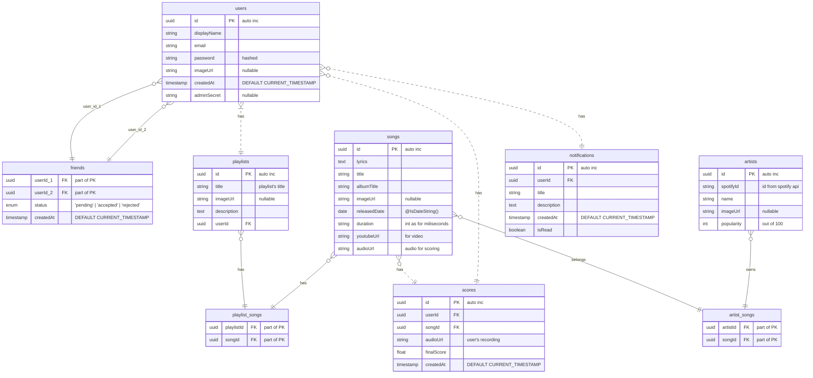
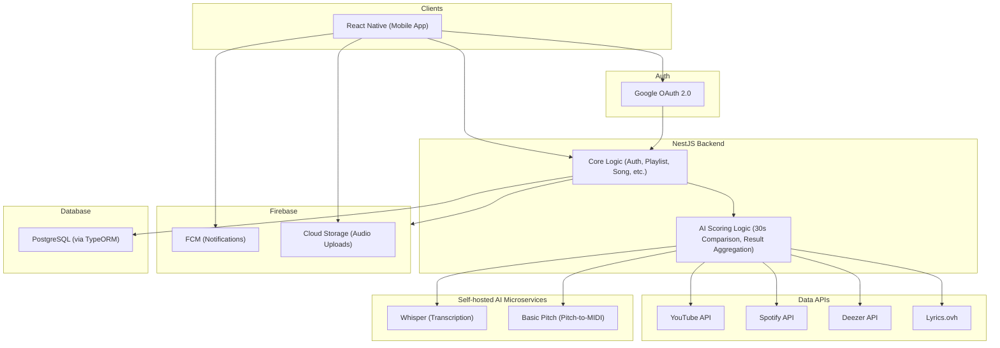

# DATABASE SCHEMA

# ARCHITECTURE


# EXTERNAL APIS

## SPOTIFY 

### Spotify API Client Credentals Flow


### Spotify Sample JSON Response
``` js
{
  "external_urls": {
    "spotify": "https://open.spotify.com/artist/4Z8W4fKeB5YxbusRsdQVPb"
  },
  "followers": {
    "href": null,
    "total": 7625607
  },
  "genres": [
    "alternative rock",
    "art rock",
    "melancholia",
    "oxford indie",
    "permanent wave",
    "rock"
  ],
  "href": "https://api.spotify.com/v1/artists/4Z8W4fKeB5YxbusRsdQVPb",
  "id": "4Z8W4fKeB5YxbusRsdQVPb",
  "images": [
    {
      "height": 640,
      "url": "https://i.scdn.co/image/ab6761610000e5eba03696716c9ee605006047fd",
      "width": 640
    },
    {
      "height": 320,
      "url": "https://i.scdn.co/image/ab67616100005174a03696716c9ee605006047fd",
      "width": 320
    },
    {
      "height": 160,
      "url": "https://i.scdn.co/image/ab6761610000f178a03696716c9ee605006047fd",
      "width": 160
    }
  ],
  "name": "Radiohead",
  "popularity": 79,
  "type": "artist",
  "uri": "spotify:artist:4Z8W4fKeB5YxbusRsdQVPb"
}
```
## YOUTUBE

### Youtube Sample JSON Response
``` js
URL: https://www.googleapis.com/youtube/v3/videos?id=7lCDEYXw3mM&key=YOUR_API_KEY
     &part=snippet,statistics&fields=items(id,snippet,statistics)

Description: This example adds the fields parameter to remove all
             kind and etag properties from the API response.

API response:

{ 
 "videos": [
  {
   "id": "7lCDEYXw3mM",
   "snippet": { 
    "publishedAt": "2012-06-20T22:45:24.000Z",
    "channelId": "UC_x5XG1OV2P6uZZ5FSM9Ttw",
    "title": "Google I/O 101: Q&A On Using Google APIs",
    "description": "Antonio Fuentes speaks to us and takes questions on working with Google APIs and OAuth 2.0.",
    "thumbnails": {
     "default": {
      "url": "https://i.ytimg.com/vi/7lCDEYXw3mM/default.jpg"
     },
     "medium": {
      "url": "https://i.ytimg.com/vi/7lCDEYXw3mM/mqdefault.jpg"
     },
     "high": {
      "url": "https://i.ytimg.com/vi/7lCDEYXw3mM/hqdefault.jpg"
     }
    },
    "categoryId": "28"
   },
   "statistics": {
    "viewCount": "3057",
    "likeCount": "25",
    "dislikeCount": "0",
    "favoriteCount": "17",
    "commentCount": "12"
   }
  }
 ]
}
```

## GOOGLE OAUTH 2.0 FLOW


