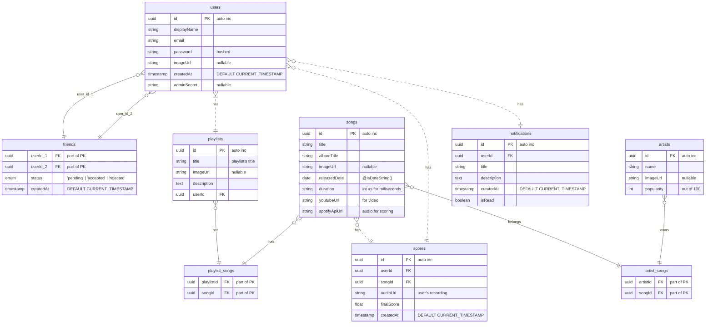
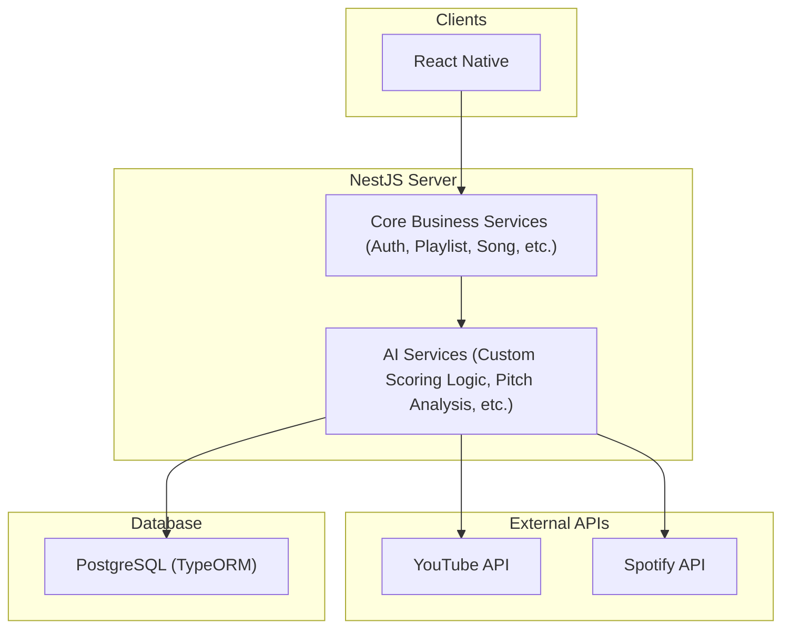

# DATABASE SCHEMA

# ARCHITECTURE


# SPOTIFY API CLIENT CREDENTIALS FLOW


## Spotify Sample JSON Response
``` js
{
  "external_urls": {
    "spotify": "https://open.spotify.com/artist/4Z8W4fKeB5YxbusRsdQVPb"
  },
  "followers": {
    "href": null,
    "total": 7625607
  },
  "genres": [
    "alternative rock",
    "art rock",
    "melancholia",
    "oxford indie",
    "permanent wave",
    "rock"
  ],
  "href": "https://api.spotify.com/v1/artists/4Z8W4fKeB5YxbusRsdQVPb",
  "id": "4Z8W4fKeB5YxbusRsdQVPb",
  "images": [
    {
      "height": 640,
      "url": "https://i.scdn.co/image/ab6761610000e5eba03696716c9ee605006047fd",
      "width": 640
    },
    {
      "height": 320,
      "url": "https://i.scdn.co/image/ab67616100005174a03696716c9ee605006047fd",
      "width": 320
    },
    {
      "height": 160,
      "url": "https://i.scdn.co/image/ab6761610000f178a03696716c9ee605006047fd",
      "width": 160
    }
  ],
  "name": "Radiohead",
  "popularity": 79,
  "type": "artist",
  "uri": "spotify:artist:4Z8W4fKeB5YxbusRsdQVPb"
}
```
